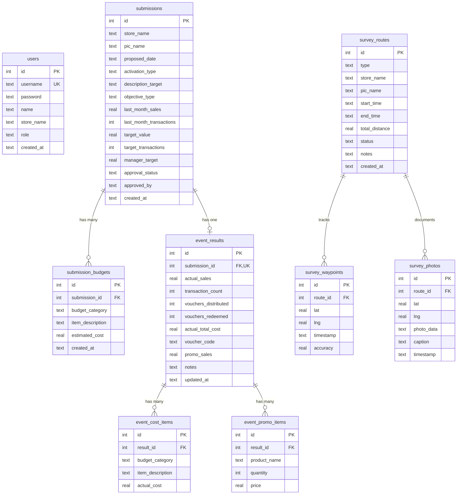

# ActiTrack — LLM System & Architecture Documentation

Dokumentasi ini dirancang khusus sebagai panduan komprehensif bagi **Large Language Models (LLM)** dan pengembang perangkat lunak untuk memahami arsitektur, basis data, alur bisnis, keamanan, dan fungsionalitas aplikasi **ActiTrack**.

---

## 1. Ringkasan Eksekutif & Domain Bisnis

**ActiTrack** adalah sistem manajemen operasional ritel multi-toko (*retail store activation & field survey tracking*) yang memfasilitasi siklus hidup promosi toko fisik dari tahap perencanaan, persetujuan, eksekusi, hingga evaluasi ROI dan verifikasi lapangan.

### Problem Domain & Solusi
1. **Pengajuan Aktivasi Promosi (Submission Wizard)**: Toko mengajukan proposal acara (contoh: *Grand Opening*, *Reguler Promo*, *Pop Up*, *Roadshow*, *Instore Demo*) beserta rincian estimasi anggaran (ATK, Cetak, Konsumsi, Sewa, dsb.).
2. **Approval & Target Management**: Tim Manajemen/HQ meninjau proposal dan menetapkan target penjualan (*manager target*), status approval (*Pending*, *Approved*, *Rejected*).
3. **Realisasi Hasil & Evaluasi Finansial**: Toko menginput hasil riil pasca-acara (sales aktual, jumlah transaksi, biaya riil, distribusi voucher, dan penjualan promo). Sistem menghitung otomatis metrik efisiensi biaya (*Cost Ratio*), *Break Even Point (BEP)*, dan performa toko.
4. **Pelacakan Lapangan & Geospasial (Field Survey & GPS Tracker)**: Petugas lapangan melakukan survei observasi atau penyebaran brosur (*mailer*) dengan pelacakan rute GPS *real-time*, pengambilan foto berkoordinat, pembersihan derau GPS (*jitter cleaning*), dan pembuatan laporan resmi Word (.docx) secara otomatis.

---

## 2. Arsitektur & Teknologi Stack

| Komponen | Teknologi | Keterangan |
|---|---|---|
| **Framework** | **Next.js 16.2.10** | App Router, Server Actions, React Server Components (RSC) |
| **UI Library** | **React 19.2.4** | Modern functional components, hooks |
| **Styling** | **Tailwind CSS v4** | `@tailwindcss/postcss`, PostCSS 8 |
| **Icons & Charts**| **Lucide React**, **Recharts** | Visualisasi dashboard, kanban, dan statistik |
| **Peta & GIS** | **Leaflet 1.9.4**, **React-Leaflet** | Rendering peta interaktif di client |
| **Pengolahan Citra** | **Sharp 0.35.3** | Merakit tile peta OSM, overlay rute SVG, kompresi foto |
| **Generator Dokumen**| **docx 9.7.1** | Pembuatan berkas laporan Word resmi (`.docx`) |
| **Database & ORM** | **Drizzle ORM 0.45**, **@libsql/client** | SQLite dialect (kompatibel Turso Cloud & SQLite lokal) |
| **Autentikasi** | **HMAC-SHA256 Signed Cookies** + **bcryptjs** | Session-based tanpa library berat (Next.js `proxy.ts`) |

---

## 3. Struktur Direktori Proyek

```
ActiTrack/
├── src/
│   ├── app/                                 # Next.js App Router
│   │   ├── (auth)/                          # Route Group Autentikasi
│   │   │   ├── login/
│   │   │   │   ├── actions.ts               # Server action login/logout
│   │   │   │   ├── login-form.tsx           # Form input login
│   │   │   │   └── page.tsx                 # Halaman login
│   │   │   └── layout.tsx
│   │   ├── (main)/                          # Route Group Aplikasi Terproteksi
│   │   │   ├── activity/page.tsx            # Analisis breakdown per tipe aktivasi
│   │   │   ├── admin/
│   │   │   │   ├── page.tsx                 # Kanban approval & review HQ
│   │   │   │   └── users/                   # Manajemen akun user & store
│   │   │   ├── calendar/page.tsx            # Kalender jadwal aktivasi toko
│   │   │   ├── comparison/page.tsx          # Perbandingan target vs realisasi
│   │   │   ├── realisasi/page.tsx           # Tabel audit realisasi anggaran
│   │   │   ├── submissions/
│   │   │   │   ├── [id]/page.tsx            # Detail pengajuan & status
│   │   │   │   ├── [id]/result/page.tsx     # Form input hasil/realisasi event
│   │   │   │   └── new/page.tsx             # Wizard 3-langkah pengajuan event
│   │   │   ├── survey/
│   │   │   │   ├── [id]/page.tsx            # Peta rute survey & galeri foto
│   │   │   │   ├── new/page.tsx             # GPS tracker langsung di HP/laptop
│   │   │   │   └── page.tsx                 # Daftar riwayat rute survey
│   │   │   ├── voucher/page.tsx             # Analisis distribusi & penukaran voucher
│   │   │   ├── layout.tsx                   # Main layout (Sidebar + BottomNav)
│   │   │   ├── loading.tsx                  # Loading state UI
│   │   │   └── page.tsx                     # Dashboard Analytics utama
│   │   ├── api/
│   │   │   └── survey/[id]/report/route.ts  # Endpoint download laporan Word (.docx)
│   │   ├── globals.css                      # Styling Tailwind
│   │   └── layout.tsx                       # Root HTML/Font Layout
│   ├── components/                          # Reusable UI Components
│   │   ├── calendar/                        # Calendar view
│   │   ├── charts/                          # Activity, Budget, Monthly, Ranking, Voucher
│   │   ├── dashboard/                       # Approval Kanban
│   │   ├── form/                            # Submission Wizard & Event Result Form
│   │   ├── survey/                          # Survey Map & Live Survey Tracker
│   │   └── ui/                              # StatCard, Sidebar, Modal, Badge, Nav
│   ├── db/                                  # Database Layer
│   │   ├── schema.ts                        # Drizzle schema (9 SQLite tables)
│   │   ├── index.ts                         # DB Client initialization (LibSQL)
│   │   ├── seed.ts                          # Seed data SQLite lokal
│   │   ├── seed-turso.ts                    # Seed data Turso cloud
│   │   └── migrate-turso.ts                 # Script migrasi DDL Turso
│   ├── lib/                                 # Business Logic & Utility Helpers
│   │   ├── actions.ts                       # Kumpulan Server Actions utama
│   │   ├── auth.ts                          # Session helper, cookie signing, bcrypt
│   │   ├── gps.ts                           # Algoritma filter GPS, Haversine, snapping
│   │   ├── report-doc.ts                    # Generator laporan Word & visualisasi peta
│   │   └── utils.ts                         # Format mata uang & tanggal
│   └── proxy.ts                             # Next.js 16 Edge Middleware (Route Guard)
├── drizzle.config.ts                        # Drizzle Kit configuration
├── package.json                             # Dependencies & Scripts
├── vercel.json                              # Konfigurasi deploy Vercel
└── README.md
```

---

## 4. Skema Basis Data (Data Model)

Sistem menggunakan 9 entitas tabel SQLite yang didefinisikan dalam [`src/db/schema.ts`](src/db/schema.ts):



### Penjelasan Tabel
1. **`users`**: Akun pengguna sistem dengan dua hak akses (`admin` atau `user`).
2. **`submissions`**: Berkas pengajuan acara promosi toko. Berisi data target penjualan, target transaksi, dan status persetujuan (`Pending`, `Approved`, `Rejected`).
3. **`submission_budgets`**: Rincian kebutuhan anggaran awal (Kategori: `ATK`, `CETAK`, `KONSUMSI`, `SEWA`, `TRANSPORT`, `DOKUMENTASI`, `LAINNYA`).
4. **`event_results`**: Hasil aktual pelaksanaan event setelah disetujui (1 submission = 1 event result).
5. **`event_cost_items`**: Detail pengeluaran biaya riil aktual yang dicatat per pos kategori.
6. **`event_promo_items`**: Produk-produk promosi khusus yang terjual (harga * kuantitas = `promoSales`).
7. **`survey_routes`**: Sesi tracking lapangan (tipe: `observasi` atau `mailer`, status: `active` atau `completed`).
8. **`survey_waypoints`**: Riwayat titik koordinat GPS berkala selama rute aktif.
9. **`survey_photos`**: Foto bukti lapangan (Base64) yang disematkan titik koordinat `lat`/`lng`.

---

## 5. Autentikasi & Kontrol Akses (RBAC & Multi-Tenancy)

Sistem menerapkan **Multi-Tenancy Berbasis Toko (*Store-Level Data Isolation*)**:

### Mekanisme Keamanan
* Cookie Sesi: `actitrack_session` bernilai format `${payload}.${signature}`.
* Signature diverifikasi menggunakan **HMAC-SHA256** dengan secret key server (`actitrack-secret-key-2026`).
* Password disimpan menggunakan hash `bcryptjs` (salt round 10).
* Middleware routing di [`src/proxy.ts`](src/proxy.ts) mencegat rute yang tidak diautentikasi dan memblokir akses ke rute `/admin` untuk non-admin.

### Pembagian Peran (Roles)
* **`admin` (HQ / Manajemen)**:
  - Melihat seluruh data dari semua cabang toko.
  - Menyetujui atau menolak pengajuan (`updateApprovalStatus`).
  - Menentukan *Manager Target* pada proposal toko.
  - Mengelola pengguna (CRUD User di `/admin/users`).
  - Menghapus submission dan memperbaiki anomali data survey (`healSurveyRoutes`).
* **`user` (Staff / PIC Toko Cabang)**:
  - Hanya dapat melihat dan mengelola data toko miliknya sendiri (`storeName` dikunci secara otomatis via `getUserStore()`).
  - Tidak dapat melihat laporan, riwayat, rute, atau pengajuan toko lain.
  - Tidak diizinkan mengakses halaman `/admin`.

---

## 6. Logika Bisnis & Perhitungan Finansial

### 1. Perhitungan Target Revenue Otomatis (Submission Wizard)
Ketika toko memasukkan estimasi biaya anggaran:
$$\text{Target Revenue} = \text{Penjualan Bulan Lalu} + \left(\frac{\text{Total Estimasi Biaya}}{0.10}\right)$$
*Prinsip: Anggaran promosi dialokasikan maksimum 10% dari kenaikan target penjualan.*

### 2. Cost Ratio (Rasio Biaya terhadap Realisasi Sales)
$$\text{Cost Ratio (\%)} = \left(\frac{\text{Total Biaya Riil}}{\text{Realisasi Sales Riil}}\right) \times 100$$
* **$\le 5\%$**: Efisien (Kinerja Sangat Baik / Hijau)
* **$5\% - 10\%$**: Hati-hati (Waspada / Kuning)
* **$> 10\%$**: Boros (Perlu Evaluasi / Merah)

### 3. Break Even Point (BEP) Rate
Suatu aktivasi toko dinyatakan mencapai BEP jika:
$$\text{Realisasi Sales} \ge \text{Total Biaya Riil}$$
$$\text{BEP Rate (\%)} = \left(\frac{\text{Jumlah Event Lolos BEP}}{\text{Total Event dengan Hasil}}\right) \times 100$$

### 4. Voucher Redemption Rate
$$\text{Voucher Rate (\%)} = \left(\frac{\text{Voucher Ditukarkan}}{\text{Voucher Disebarkan}}\right) \times 100$$

---

## 7. Engine Geospasial & Generator Laporan Word

Fitur pelacakan lapangan [`src/lib/gps.ts`](src/lib/gps.ts) dan [`src/lib/report-doc.ts`](src/lib/report-doc.ts) memiliki arsitektur mandiri tanpa ketergantungan API berbayar:

### Algoritma Pembersihan Jejak GPS (`cleanTrack`)
Titik GPS mentah dari smartphone sering mengalami lonjakan/jitter. Sistem memprosesnya melalui 4 tahap:
1. **Filter Akurasi**: Menghapus titik dengan `accuracy > 40 meter`.
2. **Median Window Filter**: Menghitung median lat/lng jendela 5 titik untuk meredam goyangan (*jitter*).
3. **Pendeteksi Lompatan & Kecepatan**:
   - Menghitung jarak antar titik menggunakan rumus **Haversine**.
   - Membuang titik jika jarak lompat $> 400\text{ m}$.
   - Membuang titik jika kecepatan berjalan $> 12\text{ m/s}$ ($43.2\text{ km/jam}$).
4. **Down-sampling**: Titik hanya disimpan jika perpindahan $\ge 5\text{ meter}$.

### Pembuatan Peta Statis Rute (Map Tile Stitching)
1. Menghitung *Bounding Box* koordinat dan menentukan *Zoom Level* optimal (13–19).
2. Mengunduh tile peta secara paralel dari 3 mirror OpenStreetMap & CartoDB dengan timeout 4 detik.
3. Menggabungkan tile menjadi satu gambar besar dan memotong (*crop*) sesuai resolusi $700 \times 400$ piksel menggunakan **Sharp**.
4. Menggambar overlay SVG jalur perjalanan (biru), pin Start (S), pin Finish (F), dan marker bernomor untuk setiap foto dokumentasi.

### Komposisi Dokumen Word (.docx)
* Dibuat secara *native* di sisi server menggunakan pustaka `docx`.
* Menyertakan:
  - Header & identitas toko, PIC, jenis survei, durasi, tanggal pelaksanaan, dan jarak tempuh.
  - Gambar peta resolusi tinggi hasil jahitan tile dengan jalur rute GPS.
  - Link otomatis pembuka rute di Google Maps.
  - Tabel matriks foto-foto dokumentasi lapangan beserta koordinat GPS dan caption.

---

## 8. Ringkasan Server Actions (`src/lib/actions.ts`)

| Kategori | Server Action | Fungsi Utama | Hak Akses |
|---|---|---|---|
| **Submission** | `createSubmission()` | Membuat pengajuan aktivasi & rincian budget | User / Admin |
| | `getSubmissionById()` | Mengambil detail lengkap proposal | Scoped Store |
| | `updateSubmissionTarget()` | Mengubah target nilai / transaksi | Pemilik / Admin |
| | `deleteSubmission()` | Menghapus pengajuan | Admin Only |
| | `updateApprovalStatus()` | Menyetujui/Menolak & mengisi manager target | Admin Only |
| **Result** | `submitEventResult()` | Input/update realisasi penjualan, biaya, promo | Pemilik / Admin |
| | `getCostItemsByResultId()` | Mengambil rincian biaya aktual | Authenticated |
| **Dashboard** | `getDashboardData()` | Statistik agregat, chart trend, ranking toko | Scoped Store |
| | `getComparisonTotals()` | Membandingkan performa bulan lalu vs sekarang | Scoped Store |
| | `getVoucherStoreBreakdown()`| Agregasi distribusi voucher per toko | Scoped Store |
| **User Mgmt** | `getUsers()` / `createUser()` | CRUD akun user dan assignment toko | Admin Only |
| | `updateUser()` / `deleteUser()` | Ubah password atau hapus akun | Admin Only |
| **Survey** | `createSurveyRoute()` | Memulai sesi tracking lapangan | User / Admin |
| | `saveWaypoints()` | Menyimpan koordinat GPS berkala (batch 500) | Pemilik Rute |
| | `saveSurveyPhoto()` | Mengunggah foto geolocated Base64 | Pemilik Rute |
| | `updateSurveyRoute()` | Menyelesaikan rute & mencatat jarak/waktu | Pemilik Rute |
| | `healSurveyRoutes()` | Menghitung ulang jarak data survei lama | Admin Only |

---

## 9. Konfigurasi Environment & Opsi Server Deployment

### Variabel Lingkungan (`.env` atau `.env.production`)
Aplikasi mendukung dua skema koneksi database di [`src/db/index.ts`](src/db/index.ts):

#### A. Cloud Database (Turso / LibSQL)
```env
TURSO_DB_URL="libsql://actitrack-database.turso.io"
TURSO_DB_AUTH_TOKEN="your-turso-jwt-token"
PORT=3000
```

#### B. Server Sendiri (Self-Hosted SQLite Lokal)
Dapat diarahkan langsung ke file database lokal di harddisk server:
```env
DATABASE_URL="file:./src/db/actitrack.db"
PORT=3000
```

### Perintah Operasional
```bash
# Install seluruh dependensi
npm install

# Inisialisasi & Seeding Database Lokal
npm run db:seed

# Menjalankan Development Server
npm run dev

# Membangun Aplikasi Produksi
npm run build

# Menjalankan Aplikasi di Server Mandiri (Produksi)
npm start

# Menjalankan via Process Manager (PM2) di VPS
pm2 start npm --name "actitrack" -- start
```

---

## 10. Catatan Khusus untuk LLM Penjaga / Pemelihara Kode

1. **Kompatibilitas Dialek Database**: Seluruh schema menggunakan `drizzle-orm/sqlite-core`. Jangan gunakan sintaks khusus PostgreSQL (`jsonb`, `serial`) atau MySQL tanpa memigrasikan schema terlebih dahulu.
2. **Isolasi Toko (*Multi-Tenancy*)**: Saat menambahkan fitur atau query baru, **selalu** gunakan helper `getUserStore()` atau `requireOwnSubmission()` agar akun user biasa tidak dapat membaca atau memodifikasi data toko lain.
3. **Pengolahan Gambar Base64**: Foto survei disimpan dalam bentuk string DataURI Base64 di kolom `photo_data`. Saat men-generate laporan Word, gambar selalu di-rotasi dan di-resize ke lebar maks 700px via Sharp untuk mencegah memori server membengkak.
4. **Next.js 16 Webpack Mode**: Perhatikan bahwa script `npm run dev` dan `npm run build` menggunakan flag `--webpack` untuk mendukung modul native C++ Sharp dan kompatibilitas binary.
